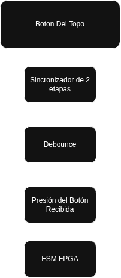
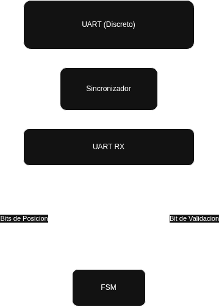
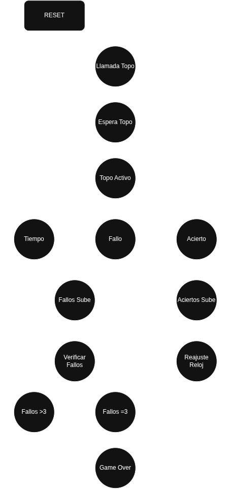

# EL3313: Taller de Diseño Digital
# Proyecto 2: Whack-a-mole vía FPGA y lógica discreta

### Introducción
Este proyecto consiste en el diseño e implementación de una versión híbrida del clásico juego electrónico **Whack-a-mole** ("golpea al topo"). 
El objetivo principal es integrar de forma práctica los conocimientos de sistemas combinacionales, secuenciales, *datapath* y *control path*. 
Para ello, el sistema propuesto divide sus tareas entre un subsistema de **lógica discreta** (implementado en *protoboard* con circuitos integrados de la familia 74xx) y un subsistema de control digital sintetizado en una **FPGA** mediante el lenguaje de descripción de hardware SystemVerilog.

El juego se desarrolla mediante la interacción de ambos entornos: el circuito discreto determina de manera pseudoaleatoria cuál de las ocho posiciones posibles ocupará el "topo", lo muestra localmente mediante un LED y envía esta información a la FPGA a través de un enlace de comunicación serial asíncrono UART. 
Por su parte, la FPGA gestiona toda la lógica de control del juego, lo que incluye la habilitación del turno, el control de la dificultad progresiva reduciendo la ventana de tiempo mediante *clock enables*, el registro de vidas (con un límite de 3 fallos consecutivos), la lectura de los pulsadores externos de golpe conectados por GPIO y la visualización de los puntajes en displays de siete segmentos. 

Este enfoque híbrido permite experimentar tanto el diseño síncrono en HDL como los retos físicos de comunicar de forma confiable dos dominios de reloj independientes que carecen de una referencia de tiempo compartida.

---
### Avance 1
---
#### **Aspectos Considerados Para El Proyecto**
**Uso de Basys 3**

Considerando el uso de la Basys 3, esta debe de coordinar:
- Control del juego
- Metraje de tiempos
- Registro y despliegue de puntajes

**Uso de botones externos**

Dado que los pulsadores externos están en un dominio de reloj independiente y generan señales asíncronas, antes de pasar por el módulo de debounce, la señal debe atravesar un sincronizador de dos etapas. 
Para la lógica de botones es de requerido de un debouncer o antirebote, por lo que será implementado de la siguiente forma:
```verilog
module debounce(
    input clk,          // Reloj de 100 MHz de la Basys 3 (Pin W5)
    input btn_in,       // Entrada física del botón con rebote
    output reg btn_out  // Salida limpia y filtrada
);

    reg [19:0] contador = 0;
    reg btn_prev = 0;
    
    always @(posedge clk) begin
        if (btn_in != btn_prev) begin
            btn_prev <= btn_in;
            contador <= 0;
        end else if (contador < 20'd1048575) begin
            contador <= contador + 1;
        end else begin
            btn_out <= btn_prev;
        end
    end
endmodule
```

**FSM**

Dificultad Progresiva: 
Por cada acierto, esta ventana se reduce en 100 ms utilizando clock enables (sin generar relojes derivados), hasta llegar a un límite mínimo de 500 ms. Esta dificultad se mantiene incluso si el jugador falla, solo se reinicia si se pierde la partida.

Gestión de Vidas y Reinicio: Un acierto reinicia el contador de fallos consecutivos a cero. Al alcanzar 3 fallos consecutivos, la FSM transiciona a un estado de Game Over durante al menos 2 segundos, indicándolo con un LED de estado, antes de reiniciar el juego automáticamente.

#### **Diagramas generales**

* **Lógica de botones**:




* **UART**




* **Lógica sistema de Topos**: Para la lógica de esta se planteó una FSM tal como puede verse a continuación.



Donde se considera aspectos desde partir de un estado inicial y reset, espera de los datos del topo, hasta las consideraciones del mismo una vez llega y contempla el acierto (Aumenta conteo de aciertos y reajusta el tiempo de aparición del Topo) o fallo por tiempo o tiro del topo equivocado (Registra fallos hasta que sean más de tres y de ahí termina el juego).

