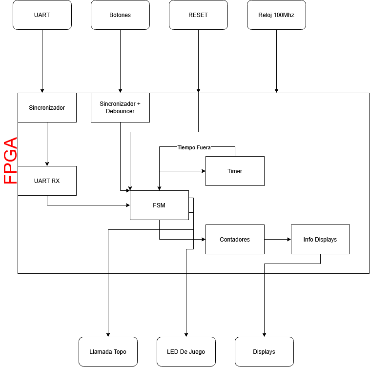
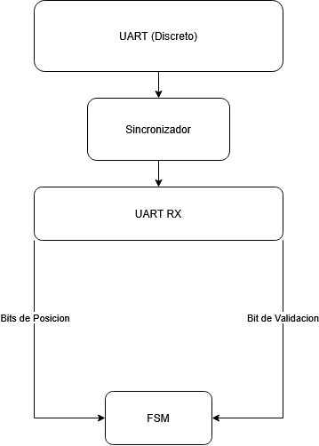
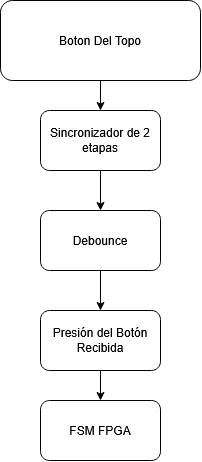
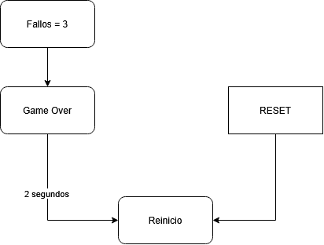
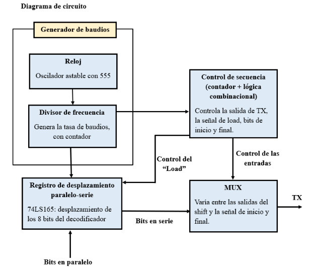
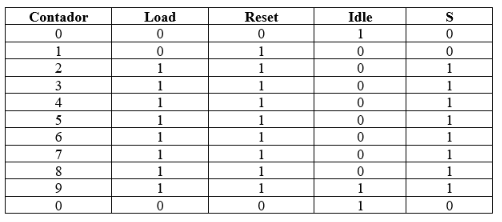

## Aspectos Considerados Para El Proyecto
**Uso de Basys 3**

Considerando el uso de la Basys 3, esta debe de coordinar:
- Control del juego
- Metraje de tiempos
- Registro y despliegue de puntajes

**Uso de botones externos**

Dado que los pulsadores externos están en un dominio de reloj independiente y generan señales asíncronas, antes de pasar por el módulo de debounce, la señal debe atravesar un sincronizador de dos etapas. 
Para la lógica de botones es de requerido de un debouncer o antirebote, por lo que será implementado de la siguiente forma:
```verilog
module debounce(
    input clk,          // Reloj de 100 MHz de la Basys 3 (Pin W5)
    input btn_in,       // Entrada física del botón con rebote
    output reg btn_out  // Salida limpia y filtrada
);

    reg [19:0] contador = 0;
    reg btn_prev = 0;
    
    always @(posedge clk) begin
        if (btn_in != btn_prev) begin
            btn_prev <= btn_in;
            contador <= 0;
        end else if (contador < 20'd1048575) begin
            contador <= contador + 1;
        end else begin
            btn_out <= btn_prev;
        end
    end
endmodule
```

**FSM**

Dificultad Progresiva: 
Por cada acierto, esta ventana se reduce en 100 ms utilizando clock enables (sin generar relojes derivados), hasta llegar a un límite mínimo de 500 ms. Esta dificultad se mantiene incluso si el jugador falla, solo se reinicia si se pierde la partida.

Gestión de Vidas y Reinicio: Un acierto reinicia el contador de fallos consecutivos a cero. Al alcanzar 3 fallos consecutivos, la FSM transiciona a un estado de Game Over durante al menos 2 segundos, indicándolo con un LED de estado, antes de reiniciar el juego automáticamente.

## Circuito discreto
Este sistema se encarga de seleccionas psudoaleatoriamente un led y lo enciende, funciona usando un registro de desplazamiento con retroalimentación lineal para generar un numero de tres bits cada vez que la fpga lo indique, este funciona con 3 flip flops en serie donde la entrada del primero es la salida de una compuerta xor cuyas entradas son las salidas de los otros flip flops, cada vez que la fpga envia la señal esta llega a la entrada de reloj para que los bits de salida que dan los fliop flops se desplazan generando asi un numero de tres bits. Una vez genrado el numero de tres bits, este pasa por el decodificador 74LS138 el cual dependiendo del numero binario generado anteriormente enciende una de las 8 posibles entradas, estas entradas se conectan a los 8 leds. Por ultimo mediante un 74LS165 se empaqueta una secuencia de 8 bits que se envian a la fpga para indicarle cual posicion actual tiene al led encendido.

### Diagrama de primer nivel


### Diagrama de segundo nivel


Bloques:

Generador pseudoaleatorio

Entrada: señal de reloj/solicitud.
Salida: número pseudoaleatorio.
Objetivo: producir la posición del topo.

Visualización:

Entrada: número generado.
Salida: uno de ocho LEDs.
Objetivo: mostrar físicamente la posición seleccionada.

Transmisor serial:

Entrada: número generado y señal de control.
Salida: TX.
Objetivo: transmitir la posición hacia la FPGA.

### Diagrama de tercer nivel


Objetivo
Generar una secuencia pseudoaleatoria de estados utilizando un registro de desplazamiento con retroalimentación lineal.

Entradas
CLK
RESET/INICIALIZACIÓN
eventualmente SOLICITUD
Salidas
Q3
Q2
Q1
Q0

## Subsistema de Control

### Descripción General
El subsistema de control es implementado en la FPGA y es el encargado de manejar la lógica general del juego. Este recibe distintas señales de entrada, como la señal del botón de RESET, la información de la posición del Topo proveniente del circuito discreto mediante UART, las señales correspondientes a los botones de los topos y el reloj global de 100 MHz. A partir de estas entradas, el subsistema se encarga de controlar el funcionamiento del juego, incluyendo la secuencia de estados, la temporización, el conteo de aciertos y fallos, la dificultad y la visualización de los resultados.
### Diagrama de Bloques

### Maquina de Estados
.png)


|  Estado Actual   |                                 Condición de Salto                                  |                                       Acción a realizar                                       |   Salto a Realizar   |
| :--------------: | :---------------------------------------------------------------------------------: | :-------------------------------------------------------------------------------------------: | :------------------: |
|   Llamada Topo   |                 Se realiza el análisis del golpe del Topo anterior                  |                              Se pide la nueva posición del Topo                               |     Espera Topo      |
|   Espera Topo    |                    Se recibe la posición del Topo desde la UART                     |                       Se procesa y se guarda la nueva posición del Topo                       |     Topo Activo      |
|   Topo Activo    |         La posición nueva del Topo fue procesada y almacenada correctamente         |      Se inicia el tiempo permitido para realizar un golpe al Topo, recibiendo cada input      | Tiempo/Fallo/Acierto |
|     Acierto      |                   La posición elegida por el jugador es correcta                    |                              Se registra el golpe como un éxito                               |     Acierto Sube     |
|   Acierto Sube   |                   La posición elegida por el jugador es correcta                    | Se incrementa en uno el contador de aciertos y se reinicia el contador de fallos consecutivos |    Reajuste Reloj    |
|  Reajuste Reloj  |                   La posición elegida por el jugador es correcta                    |                     Se realiza el ajuste de temporizador correspondiente                      |     Llamada Topo     |
|      Tiempo      |                El tiempo disponible para realizar un golpe se acaba                 |                              Se registra el golpe como un fallo                               |      Fallo Sube      |
|      Fallo       |                  La posición elegida por el jugador es incorrecta                   |                              Se registra el golpe como un fallo                               |      Fallo Sube      |
|    Fallo Sube    |                        El golpe fue registrado como un fallo                        |    Se incrementan en uno el contador total de fallos y el contador de fallos consecutivos     |   Verificar Fallos   |
| Verificar Fallos |                        El golpe fue registrado como un fallo                        |              Se realiza la verificación de que el jugador posee vidas restantes               |  Fallos<3/Fallos=3   |
|    Fallos <3     | El golpe fue registrado como un fallo pero el jugador todavía tiene vidas restantes |                   El juego volverá a solicitar un Topo y el juego continúa                    |     Llamada Topo     |
|    Fallos =3     |   El golpe fue registrado como un fallo pero el jugador no tiene vidas restantes    |                        El juego transiciona a la pantalla de Game Over                        |      Game Over       |
|    Game Over     |   El golpe fue registrado como un fallo pero el jugador no tiene vidas restantes    |                              La pantalla despliega el Game Over                               |     Llamada Topo     |
| Cualquier Estado |                           El botón de RESET es presionado                           |     Reiniciar contadores, fallos consecutivos y temporizador; restaurar ventana a 1500 ms     |     Llamada Topo     |

### Comunicación UART
Para la comunicación mediante UART RX se tendrá en cuenta que la información proveniente del circuito discreto utiliza un formato 8N1, constituido por un bit de inicio, ocho bits de datos y un bit de parada. De los ocho bits de datos recibidos, únicamente los tres bits menos significativos serán utilizados para representar la posición del Topo, permitiendo codificar las ocho posiciones posibles. Los cinco bits restantes se mantendrán en cero o podrán ser utilizados para otra función que se decida.
Debido a que el circuito discreto y la FPGA operan con referencias de reloj independientes, la señal serial recibida deberá pasar por un sincronizador de dos etapas antes de ser procesada por el receptor UART. Una vez recibida correctamente la trama, el receptor UART generará una señal de dato válido que indicará a la FSM que la posición recibida puede ser utilizada y que se puede continuar con la ejecución del juego. En cuanto al _baud rate_, se llego al acuerdo de usar 



### Botones de los Topos
El procesamiento de los botones correspondientes a los “huecos” requiere principalmente dos procesos sobre cada una de las señales recibidas:
1. Sincronización de la señal: De manera similar a la señal recibida mediante UART, las señales provenientes de los botones son asíncronas respecto al reloj de la FPGA. Por esta razón, cada una pasará por un sincronizador de dos etapas antes de ser procesada.
2. Debounce: Debido al rebote mecánico producido al presionar los botones, pueden generarse múltiples cambios rápidos de estado durante una sola pulsación. Para evitar que estos sean interpretados como múltiples golpes, se utilizará un módulo de _debounce_ que permitirá obtener una señal estable.
Una vez realizados ambos procesos, las señales filtradas de los ocho botones podrán ser utilizadas por la FSM para determinar si la posición presionada corresponde con la posición del Topo activo.




### Temporizador y Clock Enables
Uno de los requisitos del trabajo es lograr la implementación del sistema de tiempo del juego sin la creación de relojes adicionales dentro del código, ya que todo el sistema debe utilizar el mismo reloj de 100 MHz en todo momento. Para esto, se utilizará un contador interno encargado de llevar el tiempo transcurrido mientras el Topo se encuentre activo. El valor límite de este contador dependerá de la dificultad actual del juego y será reajustado mediante el módulo “Reajuste Reloj”, permitiendo disminuir progresivamente la duración de la ventana del Topo desde 1500 ms hasta un mínimo de 500 ms. El contador comenzará su operación en el momento en que la FSM ingrese al estado “Topo Activo” y, al alcanzar el límite correspondiente, generará una señal de tiempo acabado para la FSM.
Se utilizará un clock enable para controlar cuándo el contador del temporizador puede actualizarse. Este será generado a partir del reloj principal de 100 MHz y permitirá medir los intervalos de tiempo requeridos sin crear un reloj adicional, manteniendo todo el subsistema sincronizado con una única señal de reloj.

| Número de Aciertos | Tiempo Activo del Topo (ms) |
| -----------------: | --------------------------: |
|                  0 |                        1500 |
|                  1 |                        1400 |
|                  2 |                        1300 |
|                  3 |                        1200 |
|                  4 |                        1100 |
|                  5 |                        1000 |
|                  6 |                         900 |
|                  7 |                         800 |
|                  8 |                         700 |
|                  9 |                         600 |
|           10 o más |                         500 |

### Conteo y Visualización de Resultados
- Contador de Aciertos: Lleva la cantidad total de aciertos obtenidos durante la partida y su valor se muestra en dos de los displays de 7 segmentos. Cada vez que la FSM ingrese al estado Aciertos Sube, el contador aumentará en uno.
- Contador de Fallos: Lleva la cantidad total de fallos obtenidos durante la partida y se muestra en los otros dos displays de 7 segmentos. Cada vez que la FSM ingrese al estado Fallos Sube, este contador aumentará en uno.
- Contador de Fallos Consecutivos: Este contador se utiliza para determinar cuándo termina la partida. Cada fallo incrementa su valor en uno, mientras que un acierto lo reinicia a cero. Al alcanzar tres fallos consecutivos, la FSM pasará al estado Game Over.

### Game Over y RESET
Para esta sección simplemente se requiere el designar cada uno de los estados del juego:
- Game Over: Se alcanza cuando el jugador acumula tres fallos consecutivos. El sistema permanece en este estado durante al menos 2 segundos, indicando mediante el LED de estado que la partida ha terminado. Una vez transcurrido este tiempo, se reinician los valores correspondientes a la partida y la FSM vuelve a "Llamada Topo".
- RESET: Corresponde a una condición global activada mediante el botón físico central de la tarjeta. Puede ejecutarse desde cualquier estado y provoca el reinicio inmediato de los valores asociados a la partida, llevando nuevamente la FSM a "Llamada Topo".


### Plan de Pruebas
El plan de pruebas simplemente demostrara el correcto funcionamiento tanto de cada parte individual del sistema como el sistema completo. Para esto se esperara que cada parte designada en el siguiente cuadro realize la función indicada al lado, de ser así, se considera que esa parte funciona correctamente. 

|           Sistema            |                                                         Prueba de funcionamiento a realizar                                                          |
| :--------------------------: | :--------------------------------------------------------------------------------------------------------------------------------------------------: |
|           UART RX            |                       Se recibe correctamente la información desde el circuito discreto, ya estando sincronizado correctamente                       |
|        Botones Topos         |      Se recibe correctamente la información del botón presionado, además de que la señal fue filtrada correctamente (Debouncer y Sincronizador)      |
| Temporizador y Clock Enables |           Los clock enables son capaces de ajustar correctamente el tiempo de cada Topo según la cantidad de aciertos que tenga el jugador           |
|          Game Over           |                      Si el jugador se equivoca 3 veces consecutivas, el juego despliega correctamente el estado de "Game Over"                       |
|            RESET             |                          El juego es reiniciado correctamente al presionar el botón sin importar en que estado se encuentre                          |
|     Dificultad Correcta      |                  Cada una de las velocidades es correctamente asignada al nivel de dificultad presentado en la tabla de velocidades                  |
|    Conteo y Visualización    | Los contadores suben correctamente cuando el juego alcanza "Fallos Sube" o "Aciertos Sube", además de correctamente visualizar estos en los displays |
|           FSM FPGA           |                        La lógica del juego funciona correctamente, es capaz de moverse de un estado al otro según corresponde                        |
|         Tiempo Fuera         |  Si finaliza la ventana de tiempo sin recibir una pulsación, se registra correctamente un fallo y la FSM continúa con la secuencia correspondiente.  |


### UART: módulo de transmisión
UART (Universal Asynchronous Receiver Transmitter) es un protocolo de comunicación asíncrono, capaz de transmitir información entre dos dispositivos que operan a distintas frecuencias. Este protocolo utiliza una tasa de baudios (baud rate) común entre transmisor y receptor, esto equivale a la cantidad de bits transmitidos por segundo, la elección de el baud rate puede afectar la velocidad, calidad y eficiencia de la comunicación, por lo que para este proyecto se contempla el uso de una tasa de baudios estándar baja. Para asegurar la comunicación entre dispositivos, la línea TX (de transmisión) se mantiene constantemente en 1, e indica el inicio de la transmisión bajando a 0, así mismo, tras finalizar la transmisión la línea vuelve a 1.

### Estructura del Sistema 
#### Diagrama de Primer nivel
El diseño del módulo de transmisión de la UART consta de las entradas “señal de siguiente topo” y de los ocho bits del módulo que genera la posición de topo. Sus salidas son los ocho bits transmitidos de forma serial, junto con un bit de inicio y uno de parada que indiquen a la FPGA en inicio y fin de la transmisión.

<div align="center">

</div>

#### Diagrama de Segundo Nivel
El sistema tiene un modulo que genera la tasa de transmisión de bits o baud rate, este generara una señal de reloj para todos los elementos síncronos del circuito. El generador de estados es el encargado de controlar el proceso de transmisión, tanto que es lo que se va a transmitir como el momento en que se hace, para esto se usara en conjunto con la lógica combinacional, el generador de estados es quien recibe la señal de “siguiente topo” y la utiliza para empezar a ejecutarse. Finalmente, el módulo de transmisión es el encargado de transmitir la trama serial de un bit de start, los ocho bitas de datos y el bit de stop, este modulo es el que recibe los ocho bits paralelos como entrada y genera su única salida.

<div align="center">

</div>

#### Diagrama de Tercer Nivel
El siguiente diagrama de circuito está compuesto por una señal de reloj generada con un oscilador astable con 555 y un divisor de frecuencia hecho con un contador ascendente de cuatro bits, estos dos elementos se utilizarán para generar el baud rate al que se transmiten los datos. El registro de desplazamiento paralelo-serie 74LS165 se encarga de la transmisión de los 8 bits desde el decodificador a través de la línea de transmisión TX. La parte de control de secuencia se encarga de contar los bits desplazados en cada flanco del generador de baudios así como de generar y controlar las señales de “Load” en el registro de desplazamientos, el control se hace a través de un MUX 2 a 1, el cual decide entre las entradas según el numero en el que el contador se encuentre, se planea que la primera entrada se mantenga en alto y a partir de cierto numero pase a cero (tras ser activado el contador), activando así las señales de “start (0)” y “stop (1)”, las cuales se encargan de indicar al receptor el inicio y fin de la transmisión asincrónica. La segunda entrada se conecta al registro de desplazamiento y se activa después de el “start (0)” para iniciar la transmisión en serie de los bits, finalmente se regresa a la primera entrada manteniéndola en 1 o “stop”.

<div align="center">

</div>

#### Diagrama de Cuarto Nivel
El modulo transmisor de UART recibe del decodificador ocho bits paralelos generados de forma pseudoaleatoria por el LFSR, el objetivo es transmitir esta información en una trama serial hasta la FPGA, de forma que pueda obtener la ubicación del topo, el módulo de UART de recepción se encarga de muestrear a partir del bit de inicio los datos enviados. 
Respecto a su funcionamiento, este genera una señal mediante un oscilador astable con un NE555, cuya frecuencia de 38400Hz seria divida por un contador 74LS161 entre cuatro, para generar una frecuencia de 9600, estos dos elementos conforman el modulo del generador de baudios. En un principio se tomó la decisión de definir un baud rate de 9600 bps por ser el valor estándar y ser relativamente bajo en comparación con otros valores típicos, sin embargo, la aplicación de este proyecto no requiere una alta velocidad en la transferencia de datos. A continuación, se presentan los cálculos del baud rate del módulo transmisor, empezando por el cálculo de la frecuencia de oscilación del astable con 555.

$$ f = \frac{1.44}{(R_a + 2 \cdot R_b) \cdot C} $$

Escogiendo valores de $$R_a = 750 \Omega$$, $$R_b = 1500 \Omega$$ y $$C = 10nF$$ se obtiene una frecuencia de:

$$ f = 38400Hz $$  

Ciclo de trabajo: 

$$Duty cycle = 1 - \frac{R_b}{(R_a + 2 \cdot R_b)} \times 100$$
$$Duty cycle = 60\% $$

Como el valor teórico de la frecuencia es un múltiplo exacto de 9600, el porcentaje de error al dividir la frecuencia es de 0%, al menos en los cálculos teóricos, esto permite que el porcentaje de error se limite a los valores experimentales. En el caso del modulo receptor, el porcentaje de error es bastante bajo, lo que permite que el porcentaje de error conjunto del sistema UART se concentre principalmente en la parte de hardware, cumpliendo con el error máximo de un aproximado de 5% []. El calculo de error del modulo receptor se presenta a continuación:

$$ f_{UART} = \frac{f_{FpgaClock}}{(16 \times (BRG+1)} $$

Con un BRG = 650 aproximado a partir de la misma formula y un reloj de la FPGA de 100MHz:

$$ f_{UART} = 9600.61 $$
$$ Error_{UART} = 0.006 /% $$

Para la generación de estados se considero el uso de un contador BCD que se encarga de controlar la generación de un bit de start, controlar las señales de LOAD del registro de desplazamiento 74LS165 y de controlar la salida del MUX, este control se generaría a partir de compuertas lógicas. En la siguiente tabla se muestra cada estado del contador, a partir del cual se obtuvo la lógica combinacional.

<div align="center">

</div>

En el caso de el load, este se mantiene en cero por dos estados esperando a que el bit de inicio aparezca tras el primer ciclo en la línea llamada “Idle” que corresponde a la primera entrada del MUX, por ende, el MUX también espera dos estados de reloj para poder pasar a la segunda entrada, a través de la que se desplaza la trama serial. El reset se activa automáticamente en 0 y sale de este estado a través de la señal externa proveniente de la FPGA, la cual solicita una nueva posición de topo.
Los valores de la tabla se utilizaron para determinar las compuertas lógicas necesarias, sin embargo, el contador, el load y el reset son sincrónicos, por lo que tomando en cuenta los tiempos de propagación a través de cada compuerta y del contador, y comparándolo con el tiempo que el valor debe estar estable antes de ser actualizado en el siguiente flanco por el mismo contador y el shift register, se puede saber que los valores no se actualizara en el mismo flanco en que el valor cambia, si no, uno después. Los valores de “s” (el que elije la compuerta del MUX) y de “Idle”, a diferencia del resto, no son sincrónicos, por lo que para estos se opto por utilizar un flip-flop tipo D que actualice ambos datos de forma conjunta con el resto de datos. Para definir que compuertas se usarían se usó algebra booleana para algunos casos, a continuación, se muestran las operaciones definidas:

$$ Idle = \overline{Q_B} \cdot \overline{Q_C} \cdot $\overline{Q_A \oplus Q_D}$$$

$$ Load = Q_B + Q_C + Q_D$$

$$ Reset =  Q_A + Q_B + Q_C + Q_D$$

$$ S = Q_B + Q_C + Q_D $$

#### Diagrama de Quinto Nivel
Diagramas del circuito con con compuertas e integrados:

<div align="center">

</div>

<div align="center">

</div>

### Fuentes
[1] 	TI Precision Labs – Microcontrollers “UART Protocol Overview”, sf. [online]: 
      https://www.ti.com/content/dam/videos/external-videos/zh-tw/9/3816841626001/6313217959112.mp4/subassets/uart_protocol_overview_and_error_sources_0.pdf

[2] 	R. Xie, "Design and Simulation of UART Protocol Based on FPGA," 2024 6th International Conference on Applied Machine Learning (ICAML), Dalian, China, 2024,        pp. 551-557, doi: 10.1109/ICAML64299.2024.00103.

[3] 	W. Huang and G. Sheng, "Analysis and Research on UART Communication Protocol," 2024 4th Asia-Pacific Conference on Communications Technology and Computer          Science (ACCTCS), Shenyang, China, 2024, pp. 768-771, doi: 10.1109/ACCTCS61748.2024.00140. 
