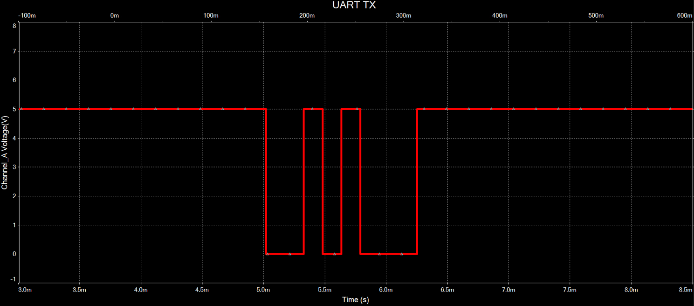
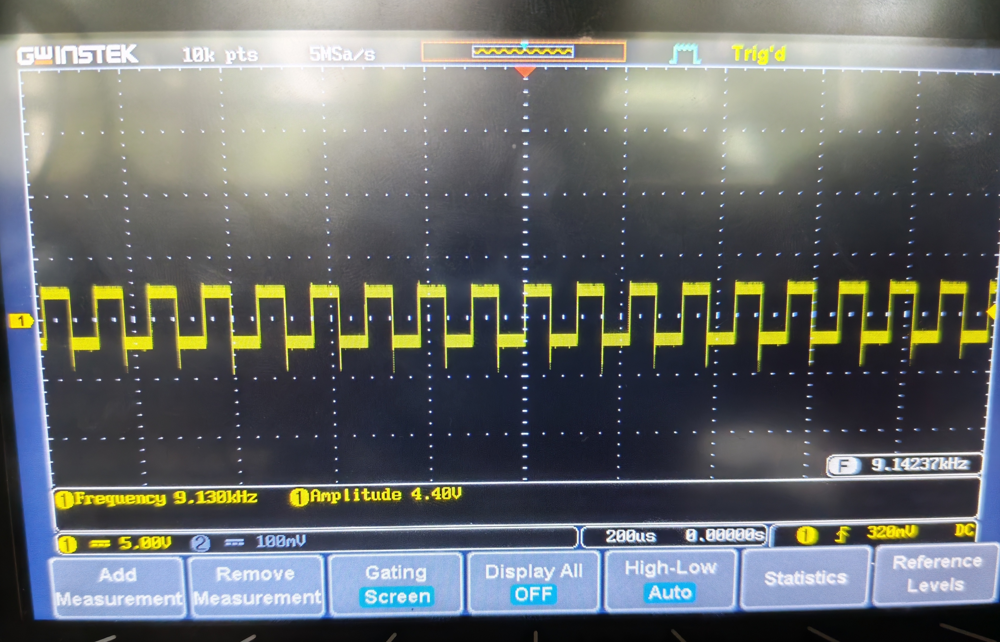
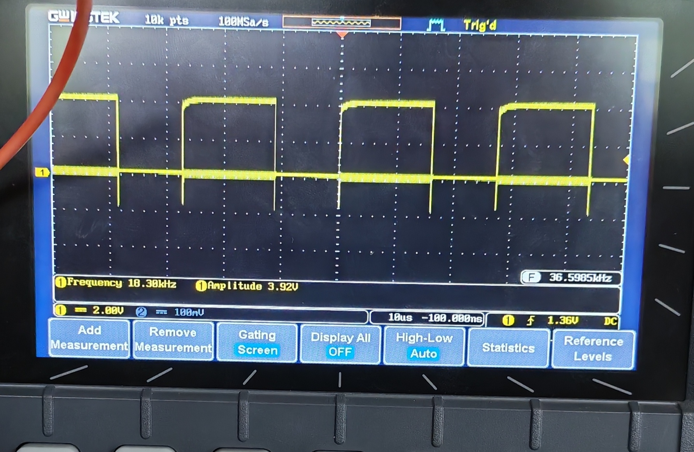

## Informe técnico — Proyecto 1: Whack-a-mole híbrido FPGA / lógica discreta
Curso: EL3313 Taller de Diseño Digital
Semestre: II Semestre 2026
Proyecto: Whack-a-mole: juego híbrido FPGA / lógica discreta
Plataforma FPGA: Digilent Basys 3
Tecnología discreta: Familia 74xx, protoboard

## Resumen
El presente informe documenta el diseño y desarrollo de un sistema digital híbrido para implementar un juego tipo Whack-a-mole, combinando lógica digital discreta y una FPGA Basys 3. El circuito discreto tiene como función generar pseudoaleatoriamente la posición de uno de ocho posibles “topos”, visualizar dicha posición mediante un LED y transmitir la información correspondiente hacia la FPGA mediante un enlace serial. La FPGA concentra la lógica principal del juego. En ella se implementa una máquina de estados finitos encargada de solicitar nuevas posiciones, recibir y almacenar la posición generada por el circuito discreto, controlar el tiempo disponible para cada topo, registrar aciertos y fallos, modificar progresivamente la dificultad y gestionar el estado de Game Over. También se contempla el procesamiento de los ocho botones externos y la visualización de los resultados mediante los displays de siete segmentos. Para el circuito discreto se plantea un generador basado en un registro de desplazamiento con retroalimentación lineal (LFSR), formado por tres flip-flops y una compuerta XOR. Los tres bits generados se aplican a un decodificador 74LS138 para seleccionar uno de ocho LEDs. Posteriormente, un registro 74LS165 permite convertir la información paralela de la posición a una secuencia serial que será enviada a la FPGA.
Al momento de elaboración del informe, la generación y visualización del número de tres bits se encuentra en implementación física en protoboard, mientras que la transmisión UART y la integración completa con la FPGA constituyen etapas posteriores de desarrollo.

## Introduccion
El proyecto consiste en desarrollar un sistema híbrido basado en una FPGA y un circuito implementado con lógica discreta. El objetivo es reproducir el funcionamiento básico de un juego Whack-a-mole, en el cual un topo aparece en una de ocho posiciones y el jugador debe presionar el botón correspondiente antes de que finalice el tiempo disponible. Una característica fundamental del proyecto es que la generación de la posición del topo no se realiza dentro de la FPGA. Esta función corresponde a un circuito montado en protoboard utilizando circuitos integrados de la familia 74xx. El circuito discreto determina pseudoaleatoriamente una posición, la representa mediante un LED y posteriormente transmite la posición a la FPGA mediante un enlace serial. Esta separación entre ambos sistemas forma parte fundamental del propósito del proyecto. La FPGA, por su parte, se encarga del control general del juego. Esta división permite trabajar simultáneamente con circuitos secuenciales y combinacionales implementados mediante lógica discreta y con diseño RTL sintetizable sobre una FPGA. Además, ambos subsistemas deben operar con referencias temporales independientes. Por lo tanto, el reloj utilizado por el circuito discreto no debe compartirse con la FPGA; la diferencia entre dominios temporales debe resolverse mediante la comunicación serial.

## Fundamentación teórica
#### Circuitos secuenciales
Un circuito secuencial es aquel cuyo comportamiento depende de las entradas actuales y del estado almacenado previamente. En este proyecto, los flip-flops tipo D se utilizan como elementos de memoria para almacenar los bits del LFSR. Cada flip-flop actualiza su salida con base en el valor presente en su entrada D durante el flanco activo del reloj.

#### Registro de desplazamiento con retroalimentación lineal
Para la generación pseudoaleatoria de la posición del topo se utiliza un registro de desplazamiento con retroalimentación lineal (LFSR, Linear Feedback Shift Register) de tres bits. El registro está compuesto por tres flip-flops tipo D, cuyos estados se representan mediante Q2, Q1 Q0.

La realimentación se implementa mediante una compuerta XOR que combina los bits Q2 y Q0. Estos bits corresponden a los taps utilizados para generar el nuevo valor que ingresa al registro. Las ecuaciones de siguiente estado son:

$$ D_2=Q_2\oplus Q_0 $$ $$ D_1=Q_2 $$ $$ D_0=Q_1 $$

La red de realimentación utilizada puede representarse mediante el polinomio:

$$ P(x)=x^3+x+1 $$

Este polinomio describe los términos utilizados en la realimentación del LFSR y permite seleccionar una configuración que produzca una secuencia de longitud máxima para un registro de tres bits. Para un LFSR de \(n=3\) bits, el período máximo es:

$$ 2^3-1=7 $$

Por lo tanto, el circuito puede recorrer siete estados diferentes de cero antes de repetir la secuencia. Para una condición inicial de \(001\), la secuencia obtenida es:

$$ 001\rightarrow100\rightarrow110\rightarrow111 \rightarrow011\rightarrow101\rightarrow010\rightarrow001 $$

El estado \(000\) no debe utilizarse como condición inicial, debido a que la realimentación XOR produce nuevamente cero y el registro permanece indefinidamente en dicho estado. Por esta razón, durante la inicialización se debe garantizar que al menos uno de los tres flip-flops se encuentre en estado lógico 1.

#### Decodificador 74LS138
El 74LS138 permite convertir las tres señales binarias del LFSR en una de ocho salidas.


Las ocho salidas se conectan a los LEDs correspondientes a las posiciones del juego.

### Subsistema de control en FPGA
#### Estructura Del Sistema
##### Primer nivel
Para la etapa del diseño se planteó una estructura dividida en tres etapas: Discreta (UART-TX y generador pseudoaleatorio, ambas etapas discretas), Botones (Conexiones de botones físicos) y FPGA (Programación bajo Basys 3). 
Dicho orden se presenta a continuación:


##### Segundo Nivel
Para esto se desglosa aspectos relevantes como la etapa discreta y la recepción por la FPGA tanto por las señales de botones como la de señal enviada por la UART. 
Adicionalmente se tiene en consideración la presencia de la lógica del juego y salidas de las señales que regresan a la etapa discreta, así como la salida del sistema. Tal como puede verse a continuación:


##### Tercer Nivel
Se tiene el desglose completo, el cual involucra:
- Etapa de sincronización y recepción de los datos discretos por parte de la UART.
- Configuración de reset y el clock por defecto de la FPGA.
- Tratamiento de los botones mediante sincronización (Para evitar Metaestabilidad), seguido de una etapa de antirebotes para asegurar entradas limpias a la FSM. 
- Estructura de FSM y salidas del comportamiento hacia los timers y señales de topo
- Comportamiento de las salidas a los Displays


#### Maquina de Estados

|  Estado Actual   |                                 Condición de Salto                                  |                                       Acción a realizar                                       |   Salto a Realizar   |
| :--------------: | :---------------------------------------------------------------------------------: | :-------------------------------------------------------------------------------------------: | :------------------: |
|   Llamada Topo   |                 Se realiza el análisis del golpe del Topo anterior                  |                              Se pide la nueva posición del Topo                               |     Espera Topo      |
|   Espera Topo    |                    Se recibe la posición del Topo desde la UART                     |                       Se procesa y se guarda la nueva posición del Topo                       |     Topo Activo      |
|   Topo Activo    |         La posición nueva del Topo fue procesada y almacenada correctamente         |      Se inicia el tiempo permitido para realizar un golpe al Topo, recibiendo cada input      | Tiempo/Fallo/Acierto |
|     Acierto      |                   La posición elegida por el jugador es correcta                    |                              Se registra el golpe como un éxito                               |     Acierto Sube     |
|   Acierto Sube   |                   La posición elegida por el jugador es correcta                    | Se incrementa en uno el contador de aciertos y se reinicia el contador de fallos consecutivos |    Reajuste Reloj    |
|  Reajuste Reloj  |                   La posición elegida por el jugador es correcta                    |                     Se realiza el ajuste de temporizador correspondiente                      |     Llamada Topo     |
|      Tiempo      |                El tiempo disponible para realizar un golpe se acaba                 |                              Se registra el golpe como un fallo                               |      Fallo Sube      |
|      Fallo       |                  La posición elegida por el jugador es incorrecta                   |                              Se registra el golpe como un fallo                               |      Fallo Sube      |
|    Fallo Sube    |                        El golpe fue registrado como un fallo                        |    Se incrementan en uno el contador total de fallos y el contador de fallos consecutivos     |   Verificar Fallos   |
| Verificar Fallos |                        El golpe fue registrado como un fallo                        |              Se realiza la verificación de que el jugador posee vidas restantes               |  Fallos<3/Fallos=3   |
|    Fallos <3     | El golpe fue registrado como un fallo pero el jugador todavía tiene vidas restantes |                   El juego volverá a solicitar un Topo y el juego continúa                    |     Llamada Topo     |
|    Fallos =3     |   El golpe fue registrado como un fallo pero el jugador no tiene vidas restantes    |                        El juego transiciona a la pantalla de Game Over                        |      Game Over       |
|    Game Over     |   El golpe fue registrado como un fallo pero el jugador no tiene vidas restantes    |                              La pantalla despliega el Game Over                               |     Llamada Topo     |
| Cualquier Estado |                           El botón de RESET es presionado                           |     Reiniciar contadores, fallos consecutivos y temporizador; restaurar ventana a 1500 ms     |     Llamada Topo     |

#### Comunicación UART
Para la comunicación mediante UART RX se tendrá en cuenta que la información proveniente del circuito discreto utiliza un formato 8N1, constituido por un bit de inicio, ocho bits de datos y un bit de parada. De los ocho bits de datos recibidos, únicamente los tres bits menos significativos serán utilizados para representar la posición del Topo, permitiendo codificar las ocho posiciones posibles. Los cinco bits restantes se mantendrán en cero o podrán ser utilizados para otra función que se decida.
Debido a que el circuito discreto y la FPGA operan con referencias de reloj independientes, la señal serial recibida deberá pasar por un sincronizador de dos etapas antes de ser procesada por el receptor UART. Una vez recibida correctamente la trama, el receptor UART generará una señal de dato válido que indicará a la FSM que la posición recibida puede ser utilizada y que se puede continuar con la ejecución del juego. En cuanto al _baud rate_, se llego al acuerdo de usar 


#### Botones de los Topos
El procesamiento de los botones correspondientes a los “huecos” requiere principalmente dos procesos sobre cada una de las señales recibidas:
1. Sincronización de la señal: De manera similar a la señal recibida mediante UART, las señales provenientes de los botones son asíncronas respecto al reloj de la FPGA. Por esta razón, cada una pasará por un sincronizador de dos etapas antes de ser procesada.
2. Debounce: Debido al rebote mecánico producido al presionar los botones, pueden generarse múltiples cambios rápidos de estado durante una sola pulsación. Para evitar que estos sean interpretados como múltiples golpes, se utilizará un módulo de _debounce_ que permitirá obtener una señal estable.
Una vez realizados ambos procesos, las señales filtradas de los ocho botones podrán ser utilizadas por la FSM para determinar si la posición presionada corresponde con la posición del Topo activo.

#### Temporizador y Clock Enables
Uno de los requisitos del trabajo es lograr la implementación del sistema de tiempo del juego sin la creación de relojes adicionales dentro del código, ya que todo el sistema debe utilizar el mismo reloj de 100 MHz en todo momento. Para esto, se utilizará un contador interno encargado de llevar el tiempo transcurrido mientras el Topo se encuentre activo. El valor límite de este contador dependerá de la dificultad actual del juego y será reajustado mediante el módulo “Reajuste Reloj”, permitiendo disminuir progresivamente la duración de la ventana del Topo desde 1500 ms hasta un mínimo de 500 ms. El contador comenzará su operación en el momento en que la FSM ingrese al estado “Topo Activo” y, al alcanzar el límite correspondiente, generará una señal de tiempo acabado para la FSM.
Se utilizará un clock enable para controlar cuándo el contador del temporizador puede actualizarse. Este será generado a partir del reloj principal de 100 MHz y permitirá medir los intervalos de tiempo requeridos sin crear un reloj adicional, manteniendo todo el subsistema sincronizado con una única señal de reloj.

| Número de Aciertos | Tiempo Activo del Topo (ms) |
| -----------------: | --------------------------: |
|                  0 |                        1500 |
|                  1 |                        1400 |
|                  2 |                        1300 |
|                  3 |                        1200 |
|                  4 |                        1100 |
|                  5 |                        1000 |
|                  6 |                         900 |
|                  7 |                         800 |
|                  8 |                         700 |
|                  9 |                         600 |
|           10 o más |                         500 |

#### Conteo y Visualización de Resultados
- Contador de Aciertos: Lleva la cantidad total de aciertos obtenidos durante la partida y su valor se muestra en dos de los displays de 7 segmentos. Cada vez que la FSM ingrese al estado Aciertos Sube, el contador aumentará en uno.
- Contador de Fallos: Lleva la cantidad total de fallos obtenidos durante la partida y se muestra en los otros dos displays de 7 segmentos. Cada vez que la FSM ingrese al estado Fallos Sube, este contador aumentará en uno.
- Contador de Fallos Consecutivos: Este contador se utiliza para determinar cuándo termina la partida. Cada fallo incrementa su valor en uno, mientras que un acierto lo reinicia a cero. Al alcanzar tres fallos consecutivos, la FSM pasará al estado Game Over.

#### Game Over y RESET
Para esta sección simplemente se requiere el designar cada uno de los estados del juego:
- Game Over: Se alcanza cuando el jugador acumula tres fallos consecutivos. El sistema permanece en este estado durante al menos 2 segundos, indicando mediante el LED de estado que la partida ha terminado. Una vez transcurrido este tiempo, se reinician los valores correspondientes a la partida y la FSM vuelve a "Llamada Topo".
- RESET: Corresponde a una condición global activada mediante el botón físico central de la tarjeta. Puede ejecutarse desde cualquier estado y provoca el reinicio inmediato de los valores asociados a la partida, llevando nuevamente la FSM a "Llamada Topo".

Optimized tool selectionVoy a revisar los archivos principales del proyecto para describir correctamente la estructura y el comportamiento del sistema antes de redactarte la explicación.

#### Estructura código
- La parte de entrada está formada por los 8 botones externos, que se sincronizan y se filtran con un circuito de debounce para evitar pulsos espurios. Cada botón se interpreta como una posición de topo, y la lógica de detección produce una señal de “BotonValido” junto con el valor del botón pulsado.
- La señal SW0 permite seleccionar entre una UART real o una simulación interna. Cuando se activa, se genera una validación de recepción UART para simular la respuesta del circuito externo, y así iniciar o continuar el flujo del juego.
- La FSM principal es el núcleo del sistema. Maneja estados como solicitud de nuevo topo, espera de recepción, topo activo, acierto, fallo, tiempo agotado, verificación de fallos y game over. En cada transición, decide si se solicita el siguiente topo, si el jugador acertó, si aumenta la dificultad o si se termina la partida.
- El módulo de generación del topo produce una posición aleatoria mediante un LFSR. Esa posición se entrega como TopoPosicion cuando llega una señal de validación UART, y la compara con la pulsación del jugador. Si coinciden, se considera acierto; si no, fallo.
- El temporizador mide el tiempo durante el cual el topo está activo. El valor máximo depende del nivel de dificultad, que aumenta progresivamente tras cada acierto. Cuando se supera el tiempo permitido, se considera “TiempoFuera” y se contabiliza como fallo.
- Los contadores llevan el registro de aciertos totales, fallos totales y fallos consecutivos. Si el jugador falla tres veces seguidas, se activa la pantalla de game over.
- La lógica de Game Over genera una ventana de espera de 2 segundos antes de reiniciar la partida, y luego vuelve a la fase inicial para comenzar otra ronda.
- La dificultad se calcula en función del número de aciertos. A medida que aumenta el nivel, el tiempo disponible para responder se reduce, haciendo el juego más exigente.
- La salida visual se realiza con LEDs y un display de 7 segmentos. Los LEDs indican el estado del sistema y la posición del topo activo, mientras que el display multiplexado presenta los contadores de aciertos y fallos de forma legible.

### Subsistema de transmisión UART
#### Diseño 
El sistema de transmisión de la UART se compone de un bloque generador de baud rate, un bloque contador generador de estados y de lógica combinacional, un registro de desplazamiento y un MUX que selecciona la salida. El bloque generador de baud rate está compuesto por un oscilador astable con NE555 que oscila a una frecuencia de 38.4kHz, esta frecuencia es dividida por un contador 74LS161 entre cuatro para obtener un baud rate de 9600bps, este valor fue escogido por ser un valor estándar usado comúnmente y por ser relativamente bajo en comparación con otros valores comunes. El bloque generador de estados y de lógica combinacional se compone por un contador BCD 74LS162 el cual controla distintos elementos según el numero en que se encuentre por medio de compuertas NOR, OR, XNOR y AND. Los elementos controlados por el contador y las expresiones de las compuertas se muestran a continuación:

<div align="center">

</div>

$$ Idle =\neg{Q_B} \cdot \neg{Q_C} \cdot \neg(Q_A \oplus Q_D) $$

$$ Load = Q_B + Q_C + Q_D$$

$$ Reset =  Q_A + Q_B + Q_C + Q_D$$

$$ S = Q_B + Q_C + Q_D $$


Tal como se explica en el documento de diseño el contador se pone así mismo en reset al llegar a 0, en este estado la línea de “Idle” se mantiene en 1 en la primera entrada del MUX 2:1, por esta razón “S” (selección de línea del MUX) también mantiene esta línea escogida durante el “estado 0”, el “Load” del Shift register se mantiene en 0, esperando para guardar los datos que provienen de LFSR. Al recibir la señal de “siguiente topo” a través de una OR, el contador BCD sale del reset y al llegar el siguiente flanco la línea de “Idle” se convierte en 0 para generar el bit de inicio, pero antes tanto el “Idle” como “S” pasan por un flip-flop tipo D para sincronizarse, al igual que el “Load” y reset, por los tiempos de propagación de las compuertas y el tiempo de estabilidad requerido para que el valor sea actualizado en el flanco por el contador y registro de desplazamiento.    

El diseño general con compuertas se muestra a continuación:

<div align="center">

</div>

El diseño general con integrados se muestra a continuación:

<div align="center">

</div>

#### Simulaciones 
En las simulaciones realizadas en multisim, se logro generar la señal de transmisión de forma correcta probando con distintos valores. en la siguiente imagen se muestra una señal transmisión con la siguiente secuencia:

| Bit / Campo | Start | A (LSB) | B | C | D | E | F | G | H (MSB) | Stop |
| :--- | :---: | :---: | :---: | :---: | :---: | :---: | :---: | :---: | :---: | :---: |
| **Valor** | 0 | 1 | 0 | 0 | 0 | 0 | 0 | 1 | 0 | 1 |

<div align="center">

</div>

#### Mediciones 
Se realizaron mediciones experimentales para definir el porcentaje de error conjunto de los módulos UART. El reloj de frecuencia de la FPGA es los suficientemente preciso para dejar la mayor parte del margen de error a la parte de transmisión, que al estar formada por elementos menos precisos se alejaba más de los valores ideales. En la siguiente imagen se muestra el resultado del divisor de baud rate:

<div align="center">

</div>

Cálculo del porcentaje de error de la UART de recepción:

$$ f_{UART} = \frac{f_{FpgaClock}}{(16 \times (BRG+1)} $$

Con un BRG = 650 aproximado a partir de la misma formula y un reloj de la FPGA de 100MHz:

$$ f_{UART} = 9600.61 $$
$$ \text{Error}_{\\text{UART RX}} = 0.006\\% $$

Cálculo del porcentaje de error de la UART de transmisión:

$$ Error_{UART TX} = \frac{9600 - 9130}{9600} \times 100$$
$$ \text{Error}_{\\text{UART TX}} = 4.9\\% $$

Se puede observar que el valor del módulo de recepción es extremadamente mas bajo que el del módulo de transmisión, cuyo reloj es mucho menos preciso que el de la FPGA, esto permite que el porcentaje de error se mantenga apenas por debajo del porcentaje de error máximo recomendado de 5% [1], lo que permitiría una lectura correcta de los datos sin que el receptor lea datos incorrectos.

La implementación de esta sección generó problemas, ya que algunos elementos funcionaban por separado únicamente, y al conectar el circuito completo la señal se distorsionaba haciendo imposible la medición y transmisión de datos. A continuación, se muestran algunas señales distorsionadas que se observaron mientras se buscaba el problema:  

<div align="center">

</div>


#### Pruebas en FPGA via Vivado
Estructura adaptada para el módulo `Botones` siguiendo el formato de la documentación base (sin secciones de abreviaturas, referencias ni numeración):

##### Módulo "Botones"

El módulo *Botones* se encarga de procesar un vector de 8 entradas de botones previamente libre de rebotes (*debounced*), validar que únicamente exista una pulsación individual activa a la vez y codificar la posición del botón presionado en una salida de 3 bits.

**Encabezado del módulo**

```SystemVerilog
module Botones (
    input logic        clk,
    input logic        RESET,
    input logic [7:0]  BotonesDebounced,
    output logic       BotonValido,
    output logic [2:0] TopoJugador
);

```

**Parámetros**

El módulo no posee parámetros.

**Entradas y salidas**

* `clk`: Entrada de reloj del sistema.
* `RESET`: Entrada de reset del módulo, activo en **alto**.
* `BotonesDebounced`: Vector de entrada de 8 bits correspondiente al estado antirrebote de los botones (`BotonesDebounced[7:0]`).
* `BotonValido`: Salida lógica. Se activa en `1` durante un pulso cuando se detecta una entrada de botón válida. Permanece en `0` si no hay botones presionados o si se detecta más de un botón presionado simultáneamente.
* `TopoJugador`: Salida de 3 bits. Indica el índice codificado (del `0` al `7`) del botón activo detectado.

**Criterios de diseño**

* **Validación de entradas:** El sistema requiere que la entrada sea de tipo *one-hot* (únicamente un bit activo a la vez). Si se detectan dos o más pulsaciones simultáneas, la señal `BotonValido` se fuerza a `0`.
* **Control de pulso:** Mantener una pulsación activa de forma continua no genera pulsos repetidos en `BotonValido`; únicamente se procesa la transición inicial.

**Testbench**

El testbench del módulo está implementado en `Botones_tb.sv`. En este entorno de prueba se instancia el módulo bajo prueba (DUT) alimentado por una señal de reloj de 100 MHz (`periodo = 10 ns`).

La suite de pruebas es auto-verificable mediante aserciones condicionales que evalúan las salidas frente a las entradas aplicadas:

* **Prueba de Reset:** Verifica que al aplicar `RESET = 1` la señal `BotonValido` sea `0` y `TopoJugador` se reinicie en `0`.
* **Pruebas de codificación individual (Botones 0 al 7):** Se estimula de forma secuencial cada posición del vector `BotonesDebounced` comprobando que `BotonValido` se active y que `TopoJugador` refleje el índice binario correspondiente (`3'd0` a `3'd7`).
* **Prueba de sostenimiento:** Confirma que al mantener presionado un botón en ciclos consecutivos de reloj, `BotonValido` retorna a `0`.
* **Prueba de simultaneidad:** Aplica dos botones activos concurrentemente (ej. `8'b00000110`), validando la invalidación de la salida (`BotonValido = 0`).
* **Prueba de re-pulsación:** Verifica la correcta respuesta tras liberar y presionar nuevamente un botón.

Salida obtenida en la terminal luego de la simulación:

```text
PASS: RESET correcto
PASS: Boton 0 detectado correctamente
PASS: Mantener boton no genera otro pulso
PASS: Boton 1 detectado correctamente
PASS: Boton 2 detectado correctamente
PASS: Boton 3 detectado correctamente
PASS: Boton 4 detectado correctamente
PASS: Boton 5 detectado correctamente
PASS: Boton 6 detectado correctamente
PASS: Boton 7 detectado correctamente
PASS: Dos botones simultaneos son invalidos
PASS: Nueva pulsacion se detecta correctamente
--------------------------------
FIN DE PRUEBAS DE BOTONES
--------------------------------
## Testbench "contadores_tb"

El módulo *contadores_tb* es el entorno de pruebas diseñado para verificar el comportamiento del acumulador de puntuación del sistema. Se encarga de evaluar el incremento, reinicio autónomo y límites de saturación de los registros de aciertos y fallos.

**Encabezado del módulo**

```SystemVerilog
module contadores_tb;
    // Entradas
    logic clk;
    logic RESET;
    logic AciertosSube;
    logic FallosSube;
    logic ReiniciarFallosConsecutivos;
    logic ReiniciarJuego;

    // Salidas
    logic [6:0] AciertosTotales;
    logic [6:0] FallosTotales;
    logic [1:0] FallosConsecutivos;

```

**Parámetros**

El módulo no posee parámetros.

**Entradas y salidas**

* `clk`: Entrada de reloj del sistema (generada a 100 MHz).
* `RESET`: Entrada de reset general.
* `AciertosSube`: Entrada de control. Genera el incremento del contador de aciertos acumulados.
* `FallosSube`: Entrada de control. Genera el incremento tanto del acumulador total de fallos como del contador de fallos consecutivos.
* `ReiniciarFallosConsecutivos`: Entrada de control. Limpia a `0` la cuenta de fallos consecutivos sin alterar los totales.
* `ReiniciarJuego`: Entrada de reset lógico. Restablece todos los contadores del sistema a su estado inicial.
* `AciertosTotales`: Salida de 7 bits. Indica el total de aciertos acumulados.
* `FallosTotales`: Salida de 7 bits. Indica el total de fallos acumulados.
* `FallosConsecutivos`: Salida de 2 bits. Registra la racha actual de fallos consecutivos.

**Criterios de diseño**

* **Lógica de acumulación:** Los incrementos operan sincronizados al flanco de subida de `clk`. Un acierto exitoso reinicia de forma implícita la racha de `FallosConsecutivos`.
* **Límites de saturación:** Para prevenir desbordamientos (*overflow*), los acumuladores de 7 bits (`AciertosTotales` y `FallosTotales`) cuentan con tope de saturación en `99` (`7'd99`), mientras que `FallosConsecutivos` (2 bits) se satura en `3` (`2'd3`).

**Testbench**

La suite implementada en `contadores_tb` es autoverificable y simula una secuencia paso a paso validando cada regla de negocio del sistema:

* **Prueba de reset e inicialización:** Comprueba la puesta a cero general mediante `RESET`.
* **Pruebas de incremento:** Valida de forma independiente el registro correcto de aciertos y fallos individuales.
* **Pruebas de reinicio parcial y por acierto:** Evalúa la limpieza de la racha consecutiva por señal explícita (`ReiniciarFallosConsecutivos`) o al encadenar un acierto (`AciertosSube`).
* **Prueba de reinicio global:** Verifica el comportamiento de `ReiniciarJuego`.
* **Pruebas de saturación:** Mediante bucles `repeat`, fuerza el exceso de eventos para constatar la detención de los contadores en `3` y `99` respectivamente.

Salida obtenida en la terminal tras finalizar la simulación:

```text
PASS: RESET reinicia todos los contadores
PASS: AciertosTotales incrementa correctamente
PASS: Fallo incrementa total y consecutivos
PASS: Segundo fallo consecutivo correcto
PASS: Reinicio de fallos consecutivos correcto
PASS: Acierto reinicia fallos consecutivos
PASS: ReiniciarJuego reinicia todos los contadores
PASS: FallosConsecutivos se limita a 3
PASS: AciertosTotales se limita a 99
PASS: FallosTotales se limita a 99 y consecutivos a 3
------------------------------------
FIN DE LAS PRUEBAS DE CONTADORES
------------------------------------
```
## Testbench "GameOverScreen_tb"

El módulo *GameOverScreen_tb* es el entorno de pruebas diseñado para verificar el comportamiento del temporizador de la pantalla de fin de juego. Se encarga de evaluar la correcta contención del conteo, la acumulación por milisegundos y la generación de la señal de finalización.

**Encabezado del módulo**

```SystemVerilog
module GameOverScreen_tb;
    logic clk;
    logic RESET;
    logic GameOverOut;

    logic GameOverDone;

```

**Parámetros**

* `TIEMPO_GAMEOVER_MS`: Define la duración objetivo en milisegundos antes de activar la señal de finalización. Para acelerar los tiempos de simulación, se configuró a `3` (3 ms) en la instancia del módulo bajo prueba (`DUT`).

**Entradas y salidas**

* `clk`: Entrada de reloj del sistema (generada a 100 MHz).
* `RESET`: Entrada de reset general, activo en **alto**.
* `GameOverOut`: Entrada de habilitación. Activa el temporizador de la pantalla de *Game Over* cuando está en `1`.
* `GameOverDone`: Salida lógica. Se activa en `1` una vez transcurrido el tiempo establecido por el parámetro `TIEMPO_GAMEOVER_MS`.

**Criterios de diseño**

* **Habilitación condicional:** El temporizador únicamente incrementa sus contadores internos (`ContadorCiclos` y `ContadorMs`) cuando la señal `GameOverOut` se encuentra activa (`1`). En caso contrario, permanece inactivo.
* **Acumulación de tiempo:** Genera un incremento en el contador de milisegundos cada 100,000 ciclos de reloj (correspondientes a 1 ms a una frecuencia de 100 MHz).
* **Retención y reinicio:** Al alcanzar el tiempo límite, la señal `GameOverDone` se mantiene en `1` hasta que la habilitación `GameOverOut` pase a `0`, lo que reinicia inmediatamente todos los contadores internos a su estado inicial.

**Testbench**

La suite implementada en `GameOverScreen_tb` es autoverificable y simula la secuencia del temporizador validando cada estado de la prueba:

* **Prueba de reset:** Verifica que al aplicar `RESET = 1`, tanto el contador interno de milisegundos como la señal `GameOverDone` se encuentren en `0`.
* **Prueba de inactividad:** Confirma que el temporizador permanezca en `0` sin contar ciclos ni milisegundos mientras `GameOverOut = 0`.
* **Pruebas de progresión temporal (1 ms, 2 ms y 3 ms):** Tras activar `GameOverOut = 1`, avanza 100,000 ciclos por etapa para comprobar el incremento preciso del registro de milisegundos.
* **Prueba de activación de fin:** Valida que al alcanzar el tercer milisegundo, la salida `GameOverDone` pase a nivel alto (`1`).
* **Prueba de retención:** Evalúa que `GameOverDone` permanezca activo en los ciclos de reloj posteriores a la finalización del conteo.
* **Prueba de deshabilitación y reinicio:** Desactiva `GameOverOut` (`0`) comprobando el restablecimiento inmediato de contadores y salidas a `0`.

Salida obtenida en la terminal tras finalizar la simulación:

```text
PASS: RESET correcto
PASS: No cuenta fuera de GameOver
PASS: Primer ms correcto
PASS: Segundo ms correcto
PASS: GameOverDone se activa correctamente
PASS: GameOverDone permanece activo
PASS: Salir de GameOver reinicia el modulo
--------------------------------
FIN DE PRUEBAS GAMEOVERSCREEN
--------------------------------

```
## Testbench "Sync2Step_tb"

El módulo *Sync2Step_tb* es el entorno de pruebas diseñado para verificar el funcionamiento del sincronizador de 2 etapas. Se encarga de evaluar la eliminación de metastabilidad al sincronizar una señal asíncrona de entrada con el dominio de reloj del sistema mediante la latencia esperada de dos flancos de subida.

**Encabezado del módulo**

```SystemVerilog
module Sync2Step_tb;
    // Señales del testbench
    logic clk;
    logic reset;
    logic async_signal;
    logic sync_signal;

```

**Parámetros**

El módulo no posee parámetros.

**Entradas y salidas**

* `clk`: Entrada de reloj del sistema (generada a 100 MHz).
* `reset`: Entrada de reset general, activo en **alto**.
* `async_signal`: Entrada lógica asíncrona que proviene de un dominio externo al reloj local.
* `sync_signal`: Salida lógica sincronizada con el reloj del sistema.

**Criterios de diseño**

* **Cadena de sincronización:** El módulo implementa una arquitectura basada en una cadena de dos *flip-flops* tipo D en serie para mitigar problemas de metastabilidad.
* **Latencia de respuesta:** Cualquier cambio de estado en `async_signal` requiere exactamente dos flancos de subida consecutivos de `clk` para propagarse a la salida `sync_signal`. La salida no debe cambiar de estado tras el primer ciclo.

**Testbench**

La suite implementada en `Sync2Step_tb` es autoverificable y comprueba la latencia de dos etapas del módulo frente a cambios de nivel lógico:

* **Prueba de reset:** Mantiene `reset = 1` durante dos ciclos de reloj para verificar que la salida `sync_signal` se fuerza a `0`.
* **Prueba de sincronización 0 -> 1:** Fuerza una transición asíncrona a nivel alto (`async_signal = 1`). Comprueba que en el primer flanco de reloj `sync_signal` se mantenga en `0` y que únicamente al segundo flanco pase a `1`.
* **Prueba de sincronización 1 -> 0:** Fuerza una transición asíncrona a nivel bajo (`async_signal = 0`). Valida que la salida conserve el nivel `1` en el primer flanco y se actualice a `0` tras el segundo flanco de reloj.

Salida obtenida en la terminal tras finalizar la simulación:

```text
PASS: Reset correcto
PASS: Sincronizacion 0 -> 1 correcta
PASS: Sincronizacion 1 -> 0 correcta
---------------------------------------
Pruebas de Sync2Step finalizadas
---------------------------------------

```

## Testbench "Dificultad_tb"

El módulo *Dificultad_tb* es el entorno de pruebas diseñado para verificar la lógica de escalamiento de dificultad del juego. Se encarga de evaluar el incremento progresivo del nivel, la reducción decreciente del tiempo límite en milisegundos, la saturación en el nivel máximo y la respuesta ante las señales de reinicio.

**Encabezado del módulo**

```SystemVerilog
module Dificultad_tb;
    // Entradas
    logic clk;
    logic RESET;
    logic ReajusteRelojOut;
    logic ReiniciarJuego;

    // Salidas
    logic [3:0]  NivelDificultad;
    logic [10:0] TiempoLimite;

```

**Parámetros**

El módulo no posee parámetros.

**Entradas y salidas**

* `clk`: Entrada de reloj del sistema (generada a 100 MHz).
* `RESET`: Entrada de reset general, activo en **alto**.
* `ReajusteRelojOut`: Entrada de control. Indica un evento de reajuste que incrementa el nivel de dificultad.
* `ReiniciarJuego`: Entrada de reset lógico. Restablece el nivel de dificultad y el tiempo límite a sus valores iniciales.
* `NivelDificultad`: Salida de 4 bits. Indica el nivel de dificultad actual (rango de `0` a `10`).
* `TiempoLimite`: Salida de 11 bits. Representa el tiempo límite permitido expresado en milisegundos.

**Criterios de diseño**

* **Relación Nivel vs. Tiempo:** En el nivel base (`0`), el `TiempoLimite` inicia en `1500 ms`. Cada pulso de `ReajusteRelojOut` incrementa en `1` el `NivelDificultad` y reduce el `TiempoLimite` a razón de `100 ms` por nivel.
* **Saturación:** El nivel máximo de dificultad está limitado a `10` (`4'd10`), lo que corresponde a un `TiempoLimite` mínimo de `500 ms` (`11'd500`). Pulsos adicionales de `ReajusteRelojOut` tras alcanzar el tope son ignorados.
* **Reinicio:** Las señales `RESET` y `ReiniciarJuego` fuerzan de forma inmediata el `NivelDificultad` a `0` y el `TiempoLimite` a `1500 ms`.

**Testbench**

La suite implementada en `Dificultad_tb` es autoverificable y valida la progresión y límites del módulo mediante la siguiente secuencia:

* **Prueba de reset:** Verifica que al aplicar `RESET = 1`, `NivelDificultad` sea `0` y `TiempoLimite` sea `1500 ms`.
* **Pruebas de progresión gradual (Niveles 1 y 2):** Aplica pulsos individuales en `ReajusteRelojOut` para corroborar el escalamiento paso a paso (`Nivel 1 -> 1400 ms`, `Nivel 2 -> 1300 ms`).
* **Prueba de nivel máximo:** Emplea un bucle `repeat` para avanzar hasta el `Nivel 10`, verificando que el `TiempoLimite` sea de `500 ms`.
* **Prueba de saturación:** Aplica pulsos adicionales en el nivel máximo para garantizar que el sistema no supere el `Nivel 10` ni reduzca el tiempo por debajo de `500 ms`.
* **Prueba de reinicio de juego:** Activa `ReiniciarJuego` confirmando el restablecimiento a los valores iniciales de nivel `0` y `1500 ms`.

Salida obtenida en la terminal tras finalizar la simulación:

```text
PASS: RESET coloca dificultad en nivel 0 y 1500 ms
PASS: Nivel 1 corresponde a 1400 ms
PASS: Nivel 2 corresponde a 1300 ms
PASS: Nivel 10 corresponde a 500 ms
PASS: NivelDificultad se limita a 10
PASS: ReiniciarJuego vuelve a nivel 0 y 1500 ms
------------------------------------
FIN DE LAS PRUEBAS DE DIFICULTAD
------------------------------------

```
## Testbench "Debouncer_tb"

El módulo *Debouncer_tb* es el entorno de pruebas diseñado para verificar el comportamiento del filtro antirrebote (*debouncer*). Se encarga de evaluar el filtrado de transitorios mecánicos durante la presión y liberación de entradas lógicas, asegurando que los cambios de estado se propaguen a la salida únicamente tras permanecer estables por un periodo de tiempo determinado.

**Encabezado del módulo**

```SystemVerilog
module Debouncer_tb;
    logic clk;
    logic btn_in;
    logic btn_out;

```

**Parámetros**

El módulo no posee parámetros.

**Entradas y salidas**

* `clk`: Entrada de reloj del sistema (generada a 100 MHz).
* `btn_in`: Entrada lógica asíncrona proveniente del botón o interruptor propenso a rebotes mecánicos.
* `btn_out`: Salida lógica filtrada e inmune a transitorios.

**Criterios de diseño**

* **Filtrado por ventana de tiempo:** La señal de entrada `btn_in` debe permanecer estable de forma ininterrumpida durante una ventana fija (aproximadamente 10.5 ms o 1,200,000 ciclos de reloj a 100 MHz) para que la salida `btn_out` refleje el nuevo estado.
* **Inmunidad a transitorios:** Ruídos, conmutaciones rápidas o rebotes mecánicos de menor duración que la ventana de tiempo especificada no modifican la salida, conservando el estado previo de `btn_out`.

**Testbench**

La suite implementada en `Debouncer_tb` es autoverificable mediante las tareas automáticas `wait_cycles` y `check_eq`, evaluando las siguientes condiciones de prueba:

* **Estabilización inicial:** Verifica que con `btn_in = 0` y tras dejar pasar el tiempo de filtrado, la salida se inicialice de forma estable en `0`.
* **Presión y liberación limpia:** Aplica transiciones directas de `0 -> 1` y `1 -> 0`. Constata que la salida conserve su valor previo en el instante del cambio y solo se actualice tras cumplir los 1,200,000 ciclos de estabilidad.
* **Filtrado de rebotes en la presión:** Simula una secuencia de conmutaciones ruidosas en `btn_in` al presionar. Valida la ausencia de falsos disparos en la salida antes de completar el intervalo de filtrado y asegura la transición final a `1`.
* **Filtrado de rebotes en la liberación:** Genera transitorios mecánicos simulados al soltar el botón. Confirma que la salida se mantenga en `1` durante las oscilaciones y pase a `0` estable una vez estabilizada la entrada.

Salida obtenida en la terminal tras finalizar la simulación:

```text
Inicio de la simulacion del debounce
PASS: estado inicial estabilizado en 0
PASS: salida no cambia en el instante inicial de presion
PASS: presion limpia genera salida estable en 1
PASS: salida mantiene el valor previo durante la liberacion
PASS: liberacion limpia genera salida estable en 0
PASS: rebotes no cambian la salida antes del debounce
PASS: presion con rebotes termina en salida estable en 1
PASS: rebotes durante la liberacion no cambian la salida antes del debounce
PASS: liberacion con rebotes termina en salida estable en 0
FIN de la simulacion del debounce

```
## Testbench "GameFSM_tb"

El módulo *GameFSM_tb* es el entorno de pruebas diseñado para verificar la máquina de estados finitos principal del juego (*GameFSM*). Se encarga de evaluar la secuencia de control del flujo del juego, la recepción de datos asíncronos mediante UART, la detección de aciertos y fallos, la gestión del temporizador, la reconfiguración de la dificultad y el ciclo de fin de juego (*Game Over*).

**Encabezado del módulo**

```SystemVerilog
module GameFSM_tb;
    // Entradas
    logic       clk;
    logic       RESET;
    logic       UARTValid;
    logic [2:0] TopoPosicion;
    logic [2:0] TopoJugador;
    logic       BotonValido;
    logic       TiempoFuera;
    logic [1:0] FallosConsecutivos;
    logic       GameOverDone;

    // Salidas
    logic       LlamadaTopoOut;
    logic       TopoActivoOut;
    logic       AciertosSube;
    logic       FallosSube;
    logic       ReiniciarFallosConsecutivos;
    logic       ReajusteRelojOut;
    logic       GameOverOut;
    logic       ReiniciarJuego;

```

**Parámetros**

El módulo define la codificación interna de estados mediante el uso de `localparam`:

* `LlamadaTopo` (`4'b0000`): Estado inicial que solicita una nueva posición del topo.
* `EsperaTopo` (`4'b0001`): Estado de espera a la recepción de datos válidos por UART.
* `TopoActivo` (`4'b0010`): Estado donde el topo está desplegado y expuesto a la acción del jugador.
* `Acierto` (`4'b0011`): Transición detectada cuando la posición ingresada coincide con la del topo.
* `AciertoSube` (`4'b0100`): Genera la señal de incremento de aciertos y resetea el contador de fallos.
* `ReajusteReloj` (`4 me0101`): Activa la señal para ajustar el temporizador y la dificultad.
* `Tiempo` (`4'b0110`): Estado alcanzado por agotamiento del tiempo de respuesta.
* `Fallo` (`4'b0111`): Transición detectada ante una pulsación errónea.
* `FalloSube` (`4'b1000`): Genera la señal de incremento en el contador de fallos.
* `VerificarFallos` (`4'b1001`): Evalúa el número de fallos acumulados para determinar la continuidad del juego.
* `GameOver` (`4'b1010`): Estado de fin de juego alcanzado tras acumular 3 fallos consecutivos.

**Entradas y salidas**

* `clk`: Entrada de reloj del sistema (generada a 100 MHz).
* `RESET`: Entrada de reset general, activo en **alto**.
* `UARTValid`: Entrada lógica que valida la llegada de un nuevo dato de posición.
* `TopoPosicion`: Entrada de 3 bits con la posición esperada del topo.
* `TopoJugador`: Entrada de 3 bits con la posición pulsada por el jugador.
* `BotonValido`: Pulsador activo que valida el intento del jugador.
* `TiempoFuera`: Señal de expiración del temporizador.
* `FallosConsecutivos`: Entrada de 2 bits con la cuenta actual de fallos consecutivos del jugador.
* `GameOverDone`: Señal de confirmación de fin de secuencia de *Game Over*.
* `LlamadaTopoOut`: Salida que indica la solicitud de generación de una nueva posición.
* `TopoActivoOut`: Salida activa mientras el topo está expuesto.
* `AciertosSube`: Pulso de salida para incrementar el contador de aciertos.
* `FallosSube`: Pulso de salida para incrementar el contador de fallos.
* `ReiniciarFallosConsecutivos`: Salida que restablece a cero el contador de fallos.
* `ReajusteRelojOut`: Pulso de salida para reajustar los temporizadores y la dificultad.
* `GameOverOut`: Indica la condición activa de fin de juego.
* `ReiniciarJuego`: Salida combinacional que reinicia el sistema al completar la rutina de *Game Over*.

**Criterios de diseño**

* **Flujo de juego síncrono:** La FSM avanza progresivamente entre estados siguiendo transiciones dependientes del reloj del sistema, las entradas del usuario y las temporizaciones.
* **Ruta de acierto:** La coincidencia entre `TopoPosicion` y `TopoJugador` con `BotonValido` activo debe encadenar los estados `Acierto -> AciertoSube -> ReajusteReloj -> LlamadaTopo`, reseteando la cuenta de fallos consecutivos e incrementando los aciertos.
* **Ruta de fallo y agotamiento de tiempo:** Un error en la posición pulsada o la activación de `TiempoFuera` fuerza la secuencia `Fallo/Tiempo -> FalloSube -> VerificarFallos`.
* **Límite de fallos:** Si en `VerificarFallos` la señal `FallosConsecutivos` es menor a 3 (`2'b11`), el juego continúa retornando a `LlamadaTopo`. Al alcanzar 3 fallos consecutivos, transiciona a `GameOver` y permanece allí hasta recibir `GameOverDone`.

**Testbench**

La suite implementada en `GameFSM_tb` es autoverificable y valida la máquina de estados a través de las siguientes etapas:

* **Prueba de reset:** Garantiza que al aplicar `RESET` la FSM inicie en el estado `LlamadaTopo`.
* **Ciclo de recepción UART:** Evalúa la transición `LlamadaTopo -> EsperaTopo` y valida que la FSM se mantenga a la espera hasta la llegada de `UARTValid = 1` para pasar a `TopoActivo`.
* **Evaluación de acierto:** Fuerza una coincidencia entre la posición del topo y la del jugador (`3'b101`). Valida la secuencia `Acierto -> AciertoSube -> ReajusteReloj`, corroborando la activación de `AciertosSube`, `ReiniciarFallosConsecutivos` y `ReajusteRelojOut`.
* **Evaluación de fallo por botón incorrecto:** Simula un intento fallido (`3'b010` vs `3'b111`). Constata la transición a `Fallo`, la emisión de `FallosSube` en `FalloSube` y la posterior verificación de fallos sin terminar el juego al tener menos de 3 errores.
* **Evaluación de agotamiento de tiempo:** Simula un evento de `TiempoFuera`, validando el paso por el estado `Tiempo` y la consecuente derivación hacia `FalloSube`.
* **Evaluación de Game Over y reinicio:** Ajusta `FallosConsecutivos = 2'b11` para forzar la entrada a `GameOver` y la activación de `GameOverOut`. Confirma la permanencia en dicho estado hasta recibir `GameOverDone = 1`, comprobando la generación del pulso combinacional en `ReiniciarJuego` y la posterior vuelta al estado inicial `LlamadaTopo`.

Salida obtenida en la terminal tras finalizar la simulación:

```text
PASS: RESET lleva a LlamadaTopo
PASS: LlamadaTopo -> EsperaTopo
PASS: EsperaTopo espera UARTValid
PASS: UARTValid lleva a TopoActivo
PASS: Boton correcto -> Acierto
PASS: AciertoSube genera salidas correctas
PASS: ReajusteReloj correcto
PASS: Boton incorrecto -> Fallo
PASS: FalloSube genera salida correcta
PASS: FalloSube -> VerificarFallos
PASS: Menos de 3 fallos permite continuar
PASS: TiempoFuera -> Tiempo
PASS: Tiempo -> FalloSube
PASS: 3 fallos consecutivos -> GameOver
PASS: GameOver espera GameOverDone
PASS: GameOverDone activa ReiniciarJuego
PASS: GameOverDone -> LlamadaTopo
PASS: ReiniciarJuego vuelve a 0
------------------------------------
FIN DE LAS PRUEBAS DE GameFSM
------------------------------------

```

## Testbench "BotonesIntegracion_tb"

El módulo *BotonesIntegracion_tb* es el entorno de pruebas de integración diseñado para verificar el procesamiento completo de la interfaz de entrada del juego. Se encarga de evaluar la interacción conjunta de los submódulos de sincronización de 2 etapas (`Sync2Step`), los filtros antirrebote (`debounce`) y la lógica de decodificación/monostable (`Botones`), garantizando el acondicionamiento correcto de 8 entradas físicas asíncronas.

**Encabezado del módulo**

```SystemVerilog
module BotonesIntegracion_tb;
    logic clk;
    logic RESET;

    logic [7:0] BotonesRaw;
    logic [7:0] BotonesSync;
    logic [7:0] BotonesDebounced;

    logic       BotonValido;
    logic [2:0] TopoJugador;

```

**Parámetros**

El módulo no posee parámetros.

**Entradas y salidas**

* `clk`: Entrada de reloj del sistema (generada a 100 MHz).
* `RESET`: Entrada de reset general del sistema, activo en **alto**.
* `BotonesRaw`: Vector de 8 bits que representa las entradas físicas de botones con posibles rebotes y desincronizadas.
* `BotonesSync`: Vector intermedio de 8 bits con las señales salientes de los sincronizadores.
* `BotonesDebounced`: Vector intermedio de 8 bits con las señales filtradas tras pasar por los debouncers.
* `BotonValido`: Salida lógica de pulso monoestable que indica la detección de una pulsación válida.
* `TopoJugador`: Salida de 3 bits que indica la posición codificada (0 a 7) correspondiente al botón presionado.

**Criterios de diseño**

* **Cadena de acondicionamiento multicanal:** Implementación por generación de instancias (`generate`) de 8 sincronizadores de doble etapa y 8 filtros antirrebote trabajando en paralelo para cada entrada del bus.
* **Filtrado e inmunidad:** Transitorios o rebotes de corta duración presentes en `BotonesRaw` no deben generar pulsos en `BotonValido`.
* **Generación de pulso único (Monoestable):** Independientemente de cuánto tiempo permanezca presionado un botón físico, la señal `BotonValido` debe mantenerse activa por un único ciclo de reloj.

**Testbench**

La suite implementada en `BotonesIntegracion_tb` valida el flujo completo de acondicionamiento de entradas mediante los siguientes escenarios:

* **Prueba de estabilización inicial:** Aplica reset y verifica que el bus `BotonesDebounced` se inicialice completamente en `8'b00000000`.
* **Integración botón 3 con rebote:** Simula la activación del canal 3 (`BotonesRaw[3]`) incluyendo un rebote mecánico corto. Verifica la propagación a través de las etapas `Sync2Step -> debounce -> Botones` hasta obtener `BotonValido = 1` y la decodificación correcta en `TopoJugador = 3'd3`.
* **Validación de pulso único:** Comprueba que en el flanco de reloj inmediatamente posterior, `BotonValido` retorne a `0` aun cuando la entrada continúe presionada.
* **Liberación del botón:** Retira la señal `BotonesRaw[3]` y espera a que la línea filtrada correspondiente `BotonesDebounced[3]` vuelva a `0`.
* **Integración botón 6:** Activa el canal 6 (`BotonesRaw[6]`) para validar la decodificación correcta en `TopoJugador = 3'd6` y asegurar el funcionamiento uniforme entre los distintos canales del bus.

Salida obtenida en la terminal tras finalizar la simulación:

```text
PASS: Entradas estabilizadas correctamente
PASS: Boton 3 atraveso Sync + Debounce + Botones
PASS: BotonValido dura solamente un ciclo
PASS: Liberacion del boton detectada correctamente
PASS: Boton 6 detectado correctamente
--------------------------------
FIN DE PRUEBAS DE INTEGRACION
--------------------------------

```
## Testbench "TopControl_tb"

El módulo *TopControl_tb* es el entorno de pruebas de integración a nivel superior del sistema. Su objetivo es verificar el comportamiento global del controlador del juego (`TopControl`), evaluando la secuencia de inicialización, la interacción con la interfaz de entrada de botones, el control de tiempos de solicitud de topos, el multiplexado de los displays de 7 segmentos y la evolución de la máquina de estados finitos (FSM) ante aciertos, fallos consecutivos y la condición de fin de juego (*Game Over*).

**Encabezado del módulo**

```SystemVerilog
module TopControl_tb;
    // Entradas
    logic       clk;
    logic       RESET;
    logic [7:0] BotonesRaw;
    logic       UART_RX;

    // Salidas
    logic       LlamadaTopoOut;
    logic       LED_Activo;
    logic       LED_GameOver;
    logic [6:0] seg;
    logic [3:0] an;
    logic       dp;

```

**Parámetros**

* `BIT_TIME`: Define la duración de un bit en nanosegundos para la comunicación serie UART a 9600 baudios con un reloj de sistema de 100 MHz (`104160 ns`).

**Entradas y salidas**

* `clk`: Entrada de reloj del sistema (100 MHz, período de 10 ns).
* `RESET`: Entrada de reset general del sistema, activo en **alto**.
* `BotonesRaw`: Vector de 8 bits que representa los botones físicos del jugador (activos en **bajo**).
* `UART_RX`: Entrada de datos serie asíncrona (línea en alto durante IDLE).
* `LlamadaTopoOut`: Salida indicadora del pulso extendido para solicitar la posición del nuevo topo.
* `LED_Activo`: Indicador visual de estado que se activa cuando existe un topo expuesto.
* `LED_GameOver`: Indicador visual de estado que se activa al alcanzar el máximo de fallos permitidos.
* `seg`: Bus de 7 bits para la activación de los segmentos de los displays.
* `an`: Bus de 4 bits para la habilitación multiplexada de los anódos de los displays.
* `dp`: Control del punto decimal de los displays.

**Criterios de diseño**

* **Modelo de integración:** Verifica el funcionamiento concurrente del acondicionador de botones, la FSM del juego, el temporizador, el extensor de impulsos y el controlador del display de 7 segmentos.
* **Temporización y extensión de pulso:** Comprueba que la salida `LlamadaTopoOut` sostenga su nivel activo por un tiempo significativamente mayor al pulso original de reloj para permitir su captura correcta por dispositivos periféricos.
* **Monitoreo de la FSM:** Evalúa el cambio de dificultad dinámica (reducción del tiempo límite por aciertos), el incremento del contador de aciertos y el manejo de fallos consecutivos hasta la transición al estado de *Game Over*.
* **Configuración de prueba en simulación (Transmisión discreta):** La interrupción abrupta obtenida durante la ejecución de la prueba (`Timeout esperando UARTValid`) no representa una falla en el diseño lógico del hardware ni en el receptor UART. Esto se debe a que la prueba está configurada para evaluar el flujo de recepción física estándar mediante transmisión serie real, mientras que en el diseño interno de la FPGA la llegada de datos de posición se procesa mediante una interfaz discreta/paralela interna en el entorno de simulación.

**Testbench**

La suite implementada en `TopControl_tb` ejecuta una secuencia de verificación de integración compuesta por las siguientes etapas:

* **Reset e inicialización:** Valida que al aplicar reset se limpien los contadores de aciertos y fallos, se desactive el LED de *Game Over* y se mantenga apagado el punto decimal (`dp = 1`).
* **Prueba del extensor de pulso:** Verifica que la señal `LlamadaTopoOut` permanezca activa por más de 100 ns.
* **Estabilización del bus de botones:** Aguarda la convergencia de los filtros antirrebote del bus de entradas físicas.
* **Ciclo de juego y avance de dificultad:** Inyecta la posición del topo y simula la pulsación del botón coincidente para validar la contabilización de aciertos y la actualización del nivel de dificultad.
* **Multiplexado de pantallas:** Inspecciona los vectores `an` y `seg` para verificar la correcta representación de aciertos y fallos en el display.
* **Secuencia de fallos y Game Over:** Aplica pulsaciones incorrectas repetidas hasta verificar que al llegar a 3 fallos consecutivos se active `LED_GameOver`, se desactive `LED_Activo` y el sistema retorne a un estado seguro mediante reset.

Salida obtenida en la terminal hasta el punto de conmutación del entorno de prueba:

```text
PASS: RESET inicial correcto
PASS: Punto decimal apagado
PASS: LlamadaTopoOut permanece activa mas de 100 ns
PASS: Sistema de botones estabilizado
FATAL: tb/Top_tb.sv:118: ERROR: Timeout esperando UARTValid
       Time: 11631515000  Scope: TopControl_tb.enviar_byte_uart

```


## Resultados
#### Subsistema de Control
- Se logra crear la maquina de estados correspondiente a la lógica necesaria de juego.
- Se logra crear la función de reloj correspondiente a todo el sistema de manera general, además de lograr las restricciones temporales para cada uno de los niveles de dificultad sin utilizar diferentes relojes.
- Se logra la implementación de la función de los displays además de la funcionalidad de las LEDs de la FPGA
- Se logra la implementación física de los botones externos, además de lograr la sincronización y el debounce de los inputs.
- Se logra la implementación de un sistema de pruebas para la FPGA y el subsistema de control de manera aislada, por lo que se puede revisar el subsistema por si solo.

#### Subsistema de transmisión (Sistema discreto)
El módulo de transmisión de la UART no logro aplicarse exitosamente a pesar de modificaciones, como cambios de baud rate y de lógica. Al aplicar cambios en el baud rate se observó una mejor calidad de señal en el osciloscopio, calidad que conservó al pasar por otras compuertas. Los cambios de lógica se realizaron de forma experimental, por lo que no se realizó una simulación previa, el objetivo de este cambio fue comprobar si la calidad de la señal se esta viendo perjudicada por la cantidad de compuertas que se esta utilizando, o si una de estas podría estar generando el problema de comunicación, tras la reducción de compuertas mejoro la calidad de la señal transmitida. Es posible que el problema fuese tanto el número y elección de compuertas como la velocidad de la tasa de transmisión de bits.
- Se logra diseñar un modulo generador de baud rate exitosamente.
- Se generan las salidas correctas del contador generador de estados.
- Se genera un resultado correcto en la simulación.
- El circuito construido generaba señales ruidosas y deformes en todo el circuito al conectar la lógica.
- Tras ajustes de lógica y baud rate se logró mejorar la calidad de la señal, sin embargo, no se logró la transmisión de datos.

### Conclusión
En este proyecto se llevó a cabo la implementación de un juego por medio de sistemas descritos en HDL y sintetizados en una FPGA, y sistemas de lógica discreta. Para los sistemas descritos en HDL se logró desarrollar una solución aplicando y reforzando conocimientos de cursos pasados sobre el diseño de máquinas de estado, lógica combinacional, FPGA y SystemVerilog, logrando llegar a una solución que cumpliera con los requerimientos del proyecto. Se logro implementar una maquina de estados que controlara la secuencia de el juego, el aumento progresivo de la dificultad, la implementación de botones externos y su sincronización, el uso de displays e incluso la simulación de la parte de lógica discreta.
Para el sistema discreto, se logro diseñar un subsistema LFSR que genera posiciones de forma pseudoaleatoria, enciende los leds acorde a la misma y con la capacidad de transmitir los 8 bits de forma paralela al registro de desplazamiento. El subsistema de transmisión de la UART no se logró implementar físicamente a pesar de funcionar en la simulación, es posible que la velocidad de envío de bits escogida para este módulo no fuese la ideal y que el diseño cargado de compuertas e integrados y la elección especifica de sus modelos dificultara la ubicación real del problema. En futuros diseños se optará por un diseño mas eficiente y menos propenso a errores en la medida de lo posible, también se realizara el proceso de búsqueda de errores de una forma más eficiente en cada módulo, además, se considerara detenidamente la elección de una velocidad de operación del circuito más apta. 

### Fuentes
[1]   David Harris y Sarah Harris. Digital Design and Computer Architecture. RISC-V
      Edition. Morgan Kaufmann, 2022, pagina 564. ´ ISBN: 978-0-12-820064-3.

[2] 	TI Precision Labs – Microcontrollers “UART Protocol Overview”, sf. [online]: 
      https://www.ti.com/content/dam/videos/external-videos/zh-tw/9/3816841626001/6313217959112.mp4/subassets/uart_protocol_overview_and_error_sources_0.pdf

[3] 	R. Xie, "Design and Simulation of UART Protocol Based on FPGA," 2024 6th International Conference on Applied Machine Learning (ICAML), Dalian, China, 2024,        pp. 551-557, 
      doi:   10.1109/ICAML64299.2024.00103.

[4] 	W. Huang and G. Sheng, "Analysis and Research on UART Communication Protocol," 2024 4th Asia-Pacific Conference on Communications Technology and Computer          Science (ACCTCS), Shenyang, China, 2024,         pp. 768-771, doi: 10.1109/ACCTCS61748.2024.00140. 
